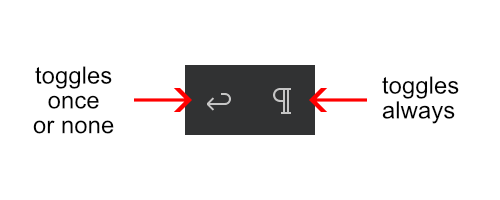

# Visual Studio Code Bugs

## Editor Title Menu Update Bug

https://github.com/microsoft/vscode/issues/111034

After the extension has started the source of the extension will be opened in an editor. In the top right corner you will see 2 additional icons like in the image below. If you click the left one (Ignore End of Line) multiple times it will toggle once or none. The right one (Ignore Leading/Trailing Whitespace) will toggle always. But the left one should also toggle always but it doesn't. This issue was not in version 1.51.1 and before. I recognized the bug on November 13th for the first time and it did not appear in the insider version on November 11th.

### Additional information

1. If the group `navigation@1` will be changed to `navigation@3` the bug does not appear.
1. Or if `config.l13Bug.ignoreTrimWhitespace == 'default'` will be removed in the when clause the bug does also not appear.